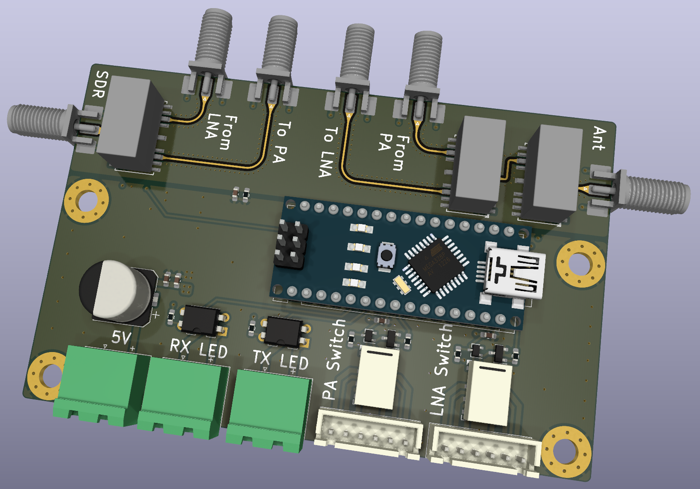
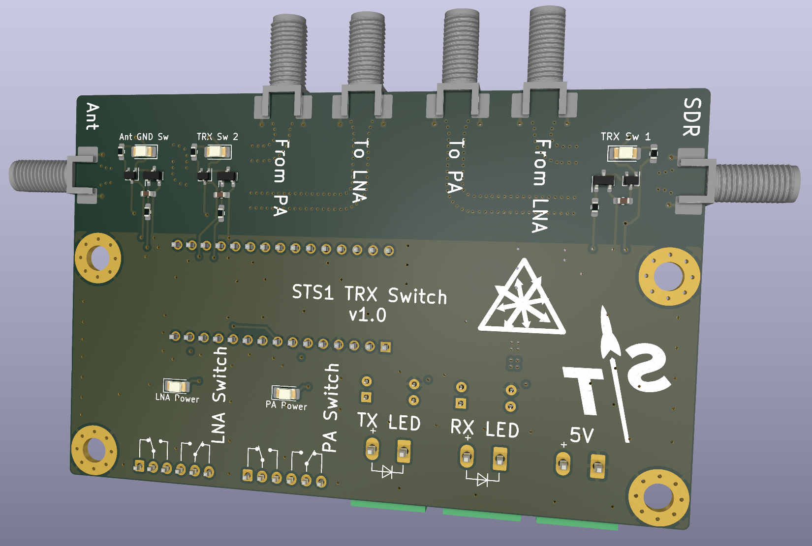

# Ground Station TRX Switch

This boards provides sequencing and switching for transmit and receive path of a satellite groundstation based on two galvanically isolated inputs.

It is controlled by an Arduino Nano which is used for timing.
It features two relay outputs for enabling a PA and LNA and three coaxial relays for RX/TX switching and antenna grounding (when neither RX nor TX is enabled).

The design was built for 435MHz but it should work up to 3GHz, although you might want to look into an impedance controlled PCB stackup for that and re-calculate the trace width with the better stackup.

## Ordering

The RF design is built for the "standard" 1.6mm thick JLCPCB 4-layer stackup consisting of the following layers:
- 35µm Outer copper
- 210.4µm Prepreg (7628, RC 49%, 8.6mil)
- 15.2µm Inner copper
- 1.065mm Core
- 15.2µm Inner copper
- 210.4µm Prepreg (7628, RC 49%, 8.6mil)
- 35µm Outer copper

## License
All files in this repository are licensed under the MIT license EXCEPT for the files in the `/3d` directory.

- Arduino Nano: By Andrew Whitham (https://grabcad.com/library/arduino-nano--1), noncommercial public use allowed (https://help.grabcad.com/article/246-how-can-models-be-used-and-shared?locale=en)
- TE HF3-53: Copyright TE Connectivity (https://www.te.com/usa-en/product-1462051-2.html)
- Molex 73251-2120: Copyright Molex LLC (https://www.molex.com/en-us/products/part-detail/0732512120)
